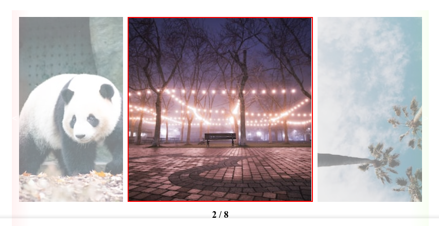

<h1 align="center"> Slider </h1>

    Exercício simples para treinar CSS e Javascript.

  <a href="#tecnologies">Tecnologias</a>&nbsp;&nbsp;&nbsp;|&nbsp;&nbsp;&nbsp;
  <a href="#project">Projeto</a>&nbsp;&nbsp;&nbsp;|&nbsp;&nbsp;&nbsp;
    <a href="#orientations">Orientações</a>&nbsp;&nbsp;&nbsp;|&nbsp;&nbsp;&nbsp;
  <a href="#challenges">Desafios</a>&nbsp;&nbsp;&nbsp;|&nbsp;&nbsp;&nbsp;
  <a href="#extres">Extras</a>&nbsp;&nbsp;&nbsp;|&nbsp;&nbsp;&nbsp;
  <a href="#license">Licença</a>

  

 

  

## 🚀 Tecnologias

 Esse projeto foi desenvolvido com as seguintes tecnologias: 

- HTML, CSS e Javascript.

## 💻 Projeto

 Esse carrossel de imagens é um projeto com o intuito de aprender mais sobre CSS e Javascript. 

## 🗺️ Orientações

<ul style="margin-left: 20px" id="orientations">
  <li> Não é necessário a instalação de nenhuma dependência.</li>
</ul>

## ⚔️ Desafios enfrentados

  Este projeto teve como principal desafio testar meus conhecimentos em CSS e Javascript. 

## 🧑‍🔧 Extras

 
  Algumas Melhorias que devem ser feitas por eu ou até mesmo por você caso queira no futuro:

  <ul style="margin-left: 20px">
      <li> Melhorar o visual; </li>
      <li> Adicionar paginação.</li>
  </ul>

<ul style="margin-left: 20px" id="orientations">
    
</ul>

## :memo: Licença

 Esse projeto está sob a licença MIT. 

